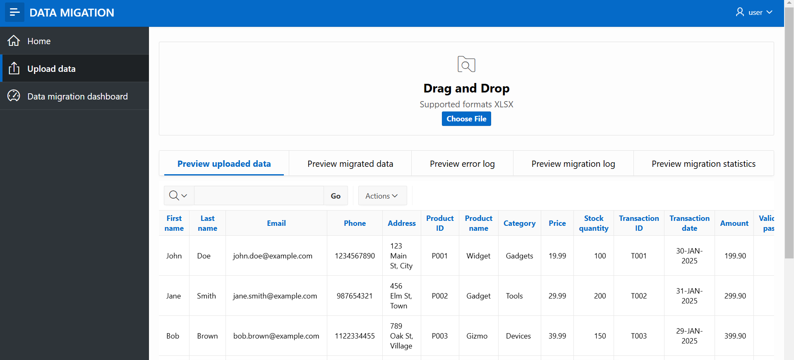
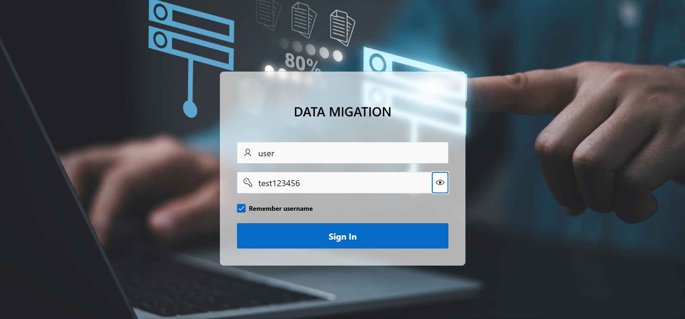

# Data Migration Dashboard  

🚀 **Oracle APEX-based dashboard for automated data validation and migration**  

## 🔹 Overview  
This project is an **Oracle APEX application** designed to simplify the **migration of structured data** from Excel/CSV files into an optimized **Oracle database**. It automates data validation, error detection, and migration while providing a **real-time dashboard** for monitoring.  After you install app that is in the file app_code.sql and its database object that are in the file DDL - Data migration.sql you can test aplication (username: user/password: test123456).

## 🔹 Features  
✅ Upload and validate **Excel/CSV files**  
✅ Detect **duplicate records, missing values, and incorrect formats**  
✅ Automated migration into **Oracle tables** via **PL/SQL procedures**  
✅ Track migration **statistics and errors** via an interactive **APEX dashboard**  
✅ Generate **custom reports** for analysis  

## 🔹 Technologies Used  
- **Oracle APEX**  
- **SQL & PL/SQL**  
- **Data Migration & ETL**  
- **Jasper Reports (if applicable)**  
- **REST API (if integrated)**  

## 🔹 How to Use  
1. **Upload an Excel file** using the APEX application  
2. The system will **validate the data and highlight errors**  
3. If no critical issues are found, **data is migrated into Oracle DB**  
4. The **dashboard provides insights into migration status and errors**  

## 🔹 Screenshots  

## 🔹 Repository Contents  
📂 **DDL - Data migration.sql** - PL/SQL scripts for database procedures  
📂 **app_code.sql** - Whole APEX application code  
📂 **/screenshots** - Application UI previews  

## 🔹 Contact  
If you need a **custom data migration solution**, feel free to reach out! 🚀  
